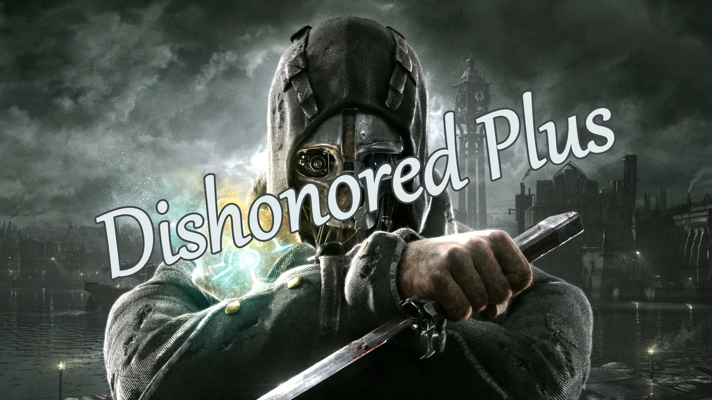
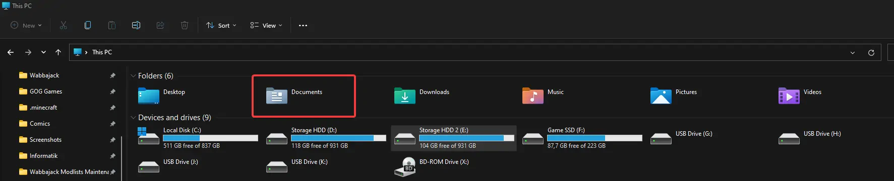

# Dishonored Plus

  
  
A **VERY** small Dishonored modlist.

## Description

This is a list that just brings some little quality of life features into Dishonored, the mid mission stats page and detection and kill notices, that are by default available in Dishonored 2, the startup movie skip, the despawning bodies fix, a non lethal drop takedown(just jump on their heads from high enough) and upscaled loading screens. This is why I called this list Dishonored Plus there simply isn't much besides these quality of life changes you can do to improve this amazing game, making this just a Dishonored + Quality of Life experience.

I would potentially have included more, but can't because there isn't really more.
The only other mods there are, I would consider cheat mods.

## Installation

### Preparation

#### Set the Game language to English

This setup might not work with non English setups, I highly recommend playing the game in English and **I will not give support to people with a non-English game if the list doesn't install**.

Open the Steam Properties window, navigate to the _Language_ tab and select _English_ from the dropdown menu.
For GOG Galaxy use the tool/settings provided.

#### Clean Game

Make sure to verify your game installation and clean out any other mods you might have installed.

### Using Wabbajack

#### Preparations

Grab the latest release of Wabbajack from [here](https://www.wabbajack.org/#/) and place the `Wabbajack.exe` file in a _working folder_. This folder **must not** be in a _common folders_ like your Desktop, Downloads or Program Files folder. It's best to create a Wabbajack folder near the root level of your drive like `C:/Wabbajack`.

#### Downloading and Installing

The download and installation process can take a very long time depending on your system specs. Wabbajack will calculate the amount of threads it will use at the start of the installation. To have the highest amount of threads and thus the fastest speed, it is advised to have the working folder on an SSD.

1. Open Wabbajack
2. Click on Browse Modlists, and download Dishonored Plus from the gallery.
3. Once the download is done set the Installation folder to somewhere that is not affected by UAC (Please do not put it in Documents, Program Files, Desktop. Put it somewhere easy like `C:/Modlists/Dishonored`). The downloads path should automatically fill in the installation path.
4. Click the Go/Begin button
5. Wait for Wabbajack to finish
6. If you run into any issues see the next section. If the installation is successful, proceed to [Post-Installation](#post-installation).

##### Problems with Wabbajack

There are a lot of different scenarios where Wabbajack will produce an error. I recommend re-running Wabbajack before posting anything. Wabbajack will continue where it left off so you loose no progress.

**Could not download x**:

If a mod updated and the old files got deleted, it is impossible to download them. In this case just wait till I update the Modlist.

**x is not a whitelisted download**:

This can happen when I update the modlist. Check if a new update is available and wait if there is none.

**Wabbajack could not find my game folder**:

Wabbajack will not work with a pirated version of the game. If you own the game on Steam, go back to the [Pre-Installation](#pre-installation) step.

## Post-Installation

### Copy Game Folder Files

- Copy the all of the files inside the `Installation Folder/Game Folder Files` directory into your game folder.  In most cases it should be called `Dishonored`.
- Copy the all of the files inside the `Installation Folder/Documents Folder Files` directory into your `Documents` folder.

- Enjoy the game.

## Credits and Thanks

- _YOU_ for actually reading the readme. Thanks a ton!!
- Halgari and everyone making Wabbajack possible.
- And ALL the mod authors that made the mods featured in this list.
- Special thanks to all the other people listed [here](https://eziothedeadpoet.github.io/AboutMe/HALLOFFAME.html) that support this and other projects of mine.

## Contact

If you need help with this list please join the [Aetherius Modding Discord](https://discord.gg/aetherius-modding)
